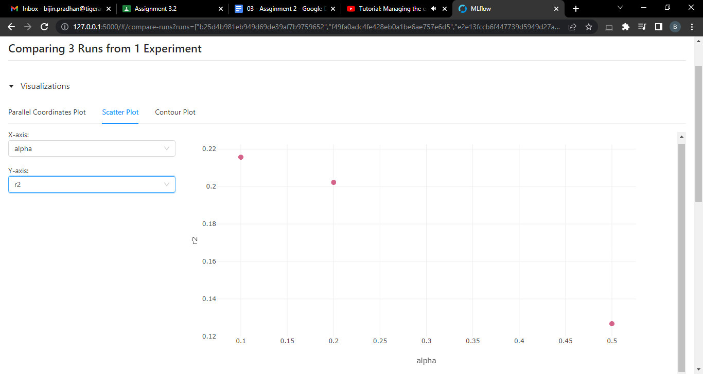

# Assignment 3.2

In this assignment, we will learn about MLFlow and how to integrate it as part of your DS workflow.

Take a look at Tiger’s documentation on MLFlow. This will serve as a compilation of useful sources on the topic.

Exercises
1. Create a separate repository and go through the hands-on MLFlow walkthrough. Submit your GitHub repository and a screenshot of the mlflow UI along with the command used to launch the MLFlow server.

2. Use mlflow to track the parameters for your housing library code. You already have scripts for data preparation, model training, model scoring. Use mlflow to track the parameters and any useful metrics in these scripts. Also, create a main script that runs everything together under a single parent mlflow run-id. Each of the child tasks (i.e. data preparation, model training etc) should get their own mlflow run-id but run as child runs of the main run. See the documentation of the start_run function to see how to create nested runs. Create a PR with your changes and submit it.

NOTE: Follow the usual process for creating a PR (create an issue with the problem statement, name the branch appropriately and so on).

Command used to open MLFlow server:

	mlflow server --backend-store-uri mlruns --default-artifact-root mlruns --host 127.0.0.1 --port 5000

